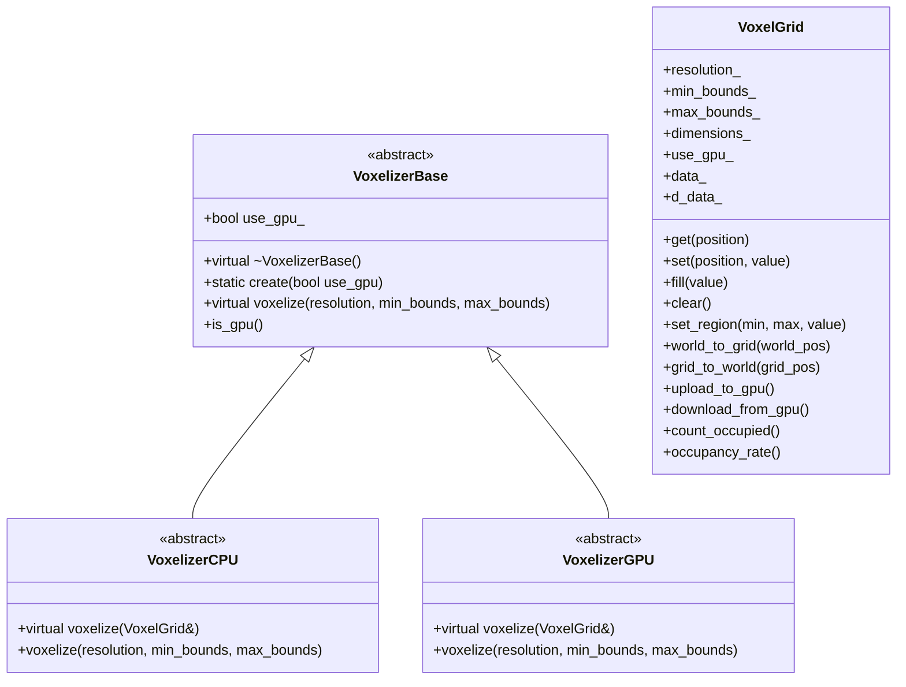

# System Overview

The Voxelization system is a framework for converting 3D geometric objects into voxel representations. It supports both CPU and GPU implementations to provide high-performance voxelization capabilities.

## Key Features

- Support for multiple geometric primitives
- CPU and GPU implementations
- Efficient memory management
- Flexible coordinate conversion
- Statistical analysis tools

## System Architecture

## Supported Geometric Primitives

1. Basic Primitives
   - Box
   - Sphere
   - Cylinder
   - Cone
   - Torus
   - Capsule

2. Line Primitives
   - Line (RLV, SLV, ILV, Bresenham)
   - Polyline

3. Complex Primitives
   - Mesh
   - Point Cloud
   - Implicit Surface
   - Signed Distance Field

## Implementation Details

### CPU Implementation

The CPU implementation uses standard C++ with Eigen for vector operations. It provides:

- Precise geometric calculations
- Easy debugging
- No external dependencies (except Eigen)

### GPU Implementation

The GPU implementation uses CUDA for parallel processing. It provides:

- High-performance parallel processing
- Efficient memory management
- Optimized for large-scale voxelization

## Memory Management

The system uses a dual-buffer approach:

1. CPU Buffer (`std::vector<bool>`)
   - Used for CPU operations
   - Provides random access
   - Easy to debug

2. GPU Buffer (`bool*`)
   - Used for GPU operations
   - Optimized for parallel access
   - Managed through CUDA

## Coordinate Systems

The system supports two coordinate systems:

1. World Coordinates
   - Continuous 3D space
   - Used for geometric operations
   - Units in meters

2. Grid Coordinates
   - Discrete 3D space
   - Used for voxel operations
   - Units in voxels

## Error Handling

The system provides comprehensive error handling:

1. Runtime Errors
   - Out-of-bounds access
   - Invalid parameters
   - Memory allocation failures

2. CUDA Errors
   - Device memory errors
   - Kernel launch errors
   - Synchronization errors

## Next Steps

- Read the [Class Reference](class_reference.md) for detailed API documentation
- Check out [Usage Examples](examples.md) for practical examples
- Review the [Performance Guide](performance.md) for optimization tips
- Learn how to extend the system in the [Extension Guide](extension.md) 