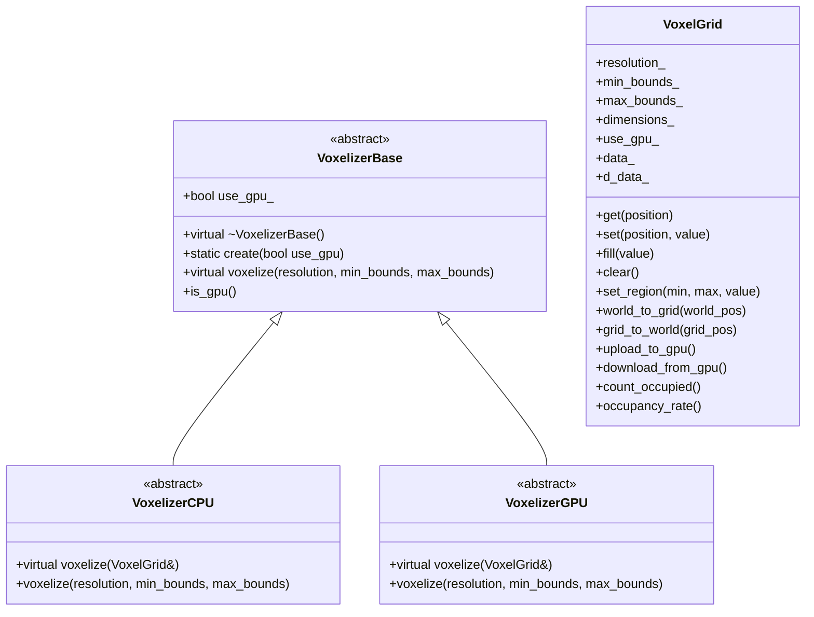

# 系统概述

体素化系统是一个用于将 3D 几何体转换为体素表示的框架。它同时支持 CPU 和 GPU 实现，以提供高性能的体素化能力。

## 主要特性

- 支持多种几何图元
- CPU 和 GPU 实现
- 高效的内存管理
- 灵活的坐标转换
- 统计分析工具

## 系统架构

## 支持的几何图元

1. 基本图元
   - 盒子
   - 球体
   - 圆柱体
   - 圆锥体
   - 圆环
   - 胶囊体

2. 线图元
   - 直线（RLV、SLV、ILV、Bresenham）
   - 折线

3. 复杂图元
   - 网格
   - 点云
   - 隐式曲面
   - 符号距离场

## 实现细节

### CPU 实现

CPU 实现使用标准 C++ 和 Eigen 进行向量运算。它提供：

- 精确的几何计算
- 易于调试
- 无外部依赖（除了 Eigen）

### GPU 实现

GPU 实现使用 CUDA 进行并行处理。它提供：

- 高性能并行处理
- 高效的内存管理
- 针对大规模体素化的优化

## 内存管理

系统使用双缓冲方法：

1. CPU 缓冲区（`std::vector<bool>`）
   - 用于 CPU 操作
   - 提供随机访问
   - 易于调试

2. GPU 缓冲区（`bool*`）
   - 用于 GPU 操作
   - 针对并行访问优化
   - 通过 CUDA 管理

## 坐标系统

系统支持两种坐标系统：

1. 世界坐标
   - 连续的 3D 空间
   - 用于几何操作
   - 单位：米

2. 网格坐标
   - 离散的 3D 空间
   - 用于体素操作
   - 单位：体素

## 错误处理

系统提供全面的错误处理：

1. 运行时错误
   - 越界访问
   - 无效参数
   - 内存分配失败

2. CUDA 错误
   - 设备内存错误
   - 内核启动错误
   - 同步错误

## 后续步骤

- 阅读 [类参考](class_reference.md) 获取详细的 API 文档
- 查看 [使用示例](examples.md) 获取实际示例
- 参考 [性能指南](performance.md) 获取优化建议
- 学习如何在 [扩展指南](extension.md) 中扩展系统